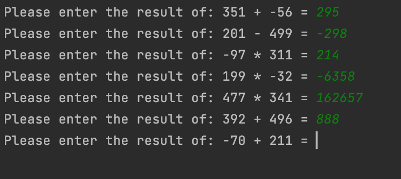
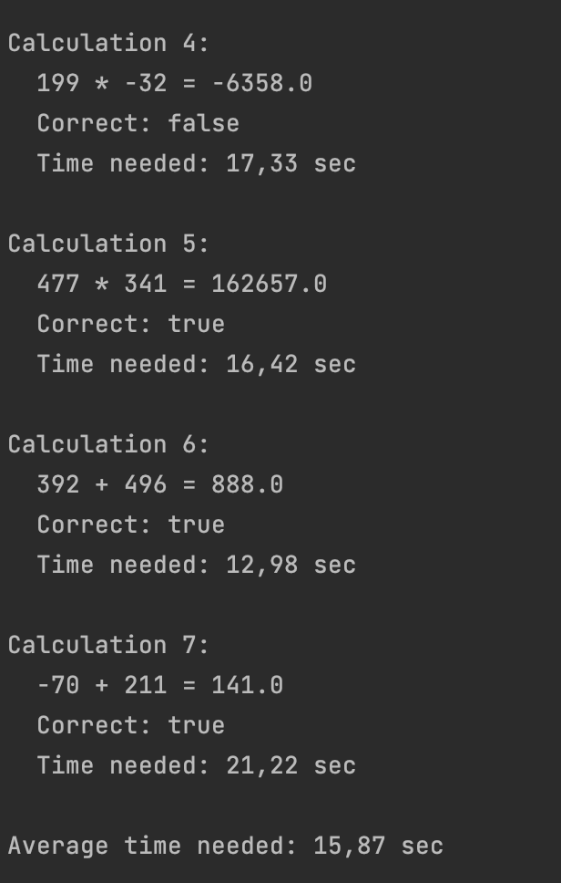

# GAME 7 #
## Game description ##
Game 7 is a java game including Math puzzles. Solve the puzzles as fast as you can and be rewarded with a winning message when answering all puzzles correctly.

## HOW TO USE ## 
The game will start by giving you 7 random math problems. Each problem will have two random whole numbers between -100 and 500 and a random math operation (+, -, *, /). Now you will have to answer the problem. It will be recorded how long you need to answer each individual question.Please make sure to input a number as your answer (can be positive and negative).

After answering all 7 problems, you will get a summary of how many problems you answered correctly and the average time of answering the questions.

# Screenshots of output #

